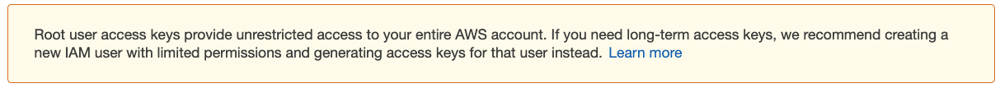
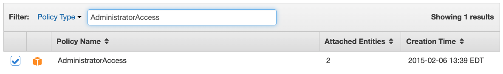
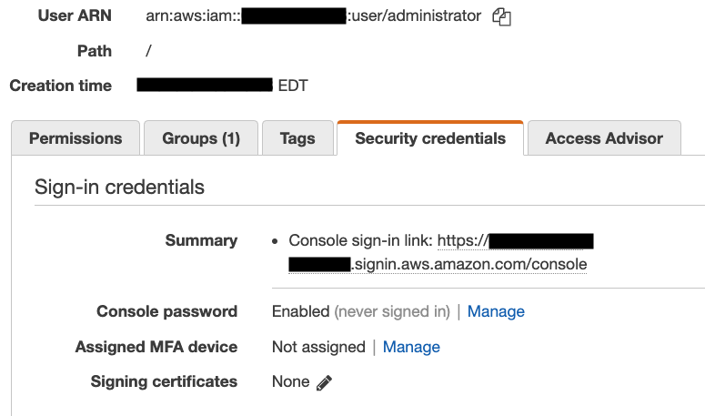
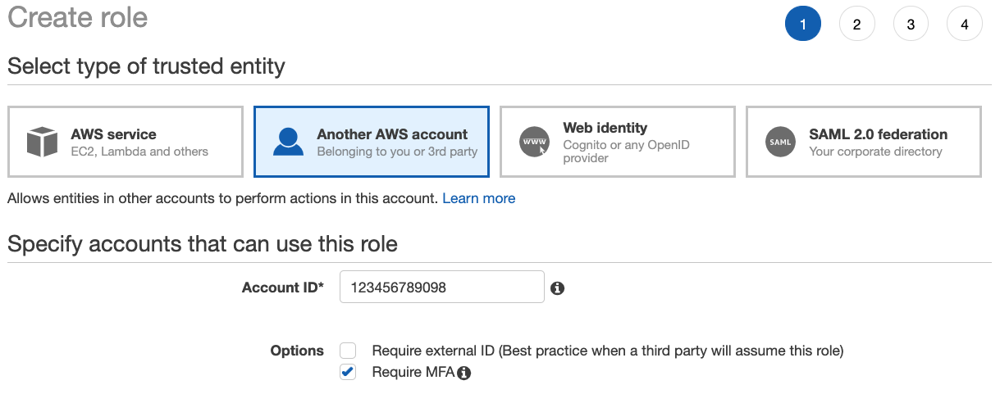
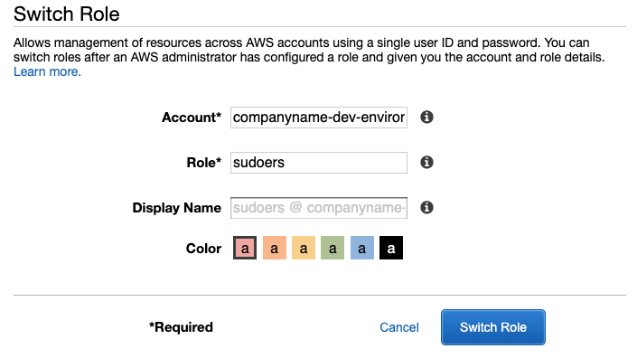

Photo by [Fotis Fotopoulos](https://unsplash.com/@ffstop?utm_source=unsplash&utm_medium=referral&utm_content=creditCopyText) on [Unsplash](https://unsplash.com/s/photos/hacker?utm_source=unsplash&utm_medium=referral&utm_content=creditCopyText)

------

For anyone that is venturing into Cloud-Computing, AWS, or Amazon Web Services, is likely to be on the short-list of options.  For a number of years AWS has been the largest cloud provider in the world, with no sign of slowing down.  They offer easy access to a ton of great features, and make it really simple to get started.  All you need is an email address and a credit card.  However, there are a few Best-Practices that you should be aware of when creating a new AWS Account.

## Golden Rules
1. Do Not Use the Root Account
1. Always Use Multi-Factor Authentication
1. Use Minimum Permissions

In this article we'll go through the process of creating an account, securing it, and then creating users and roles to grant the permissions needed, without exposing ourselves to excessive risk.

# Prerequisites
## Get a Password Manager
Before we we even create the AWS Account lets ensure that we're managing our passwords properly.  In this day and age, where everything is online, most people have at least 10 services where they need a password.  Many of us have in excess of 100 passwords.

*For good security practices, every one of your passwords should be different!*

Obviously, it is not possible for a human to remember 100+ passwords, along with the services that they are used for.  This is where the password manager comes into play.  You, the simple human, have to remember a single, high-quality password.  This password is the key to your vault of other high-quality passwords.

There are quite a few password managers on the market, but I have personal experience with the following:

* [BitWarden](https://https://bitwarden.com/) - Free
* [LastPass](https://www.lastpass.com/) - Free or Paid
* [1Password](https://1password.com/) - Paid

It doesn't matter which you choose, as long as you select one.  I've personally moved from LastPass to BitWarden, then finally to 1Password, based on the features I needed in my job.

## Virtual MFA Device: Google Authenticator
The next piece of software we'll need to secure our AWS Account is a Virtual Multi-Factor Authentication device.  This will provide you with Time-Based-One-Time Passwords, i.e. a number that changes every minute.

For simplicity, I'll recommend you install Google Authenticator.  It is free, and available for both iOS and Android.

If you are using 1Password, you can also use it to manage your MFA tokens, and don't need to install Authenticator.

# Create the Account
If you haven't yet created an AWS Account, now is the time to do it.  Simply navigate to the [AWS Console](https://aws.amazon.com/) and follow the account creation instructions.

**Make sure to use a strong password, and save the Root Account credentials to your password manager**

## Root Account Configuration
The email address you signed up with is known as the "Root Account".  This is where your AWS Bills are sent.  We're going to use the Root Account for a few fundamental tasks, then ideally never use it again.

  The Root Account is all-powerful, and should be used only when necessary.  Every other operation should be done using an IAM User and/or Role.

### Enable MFA on the Root Account
While logged in to the Root Account
1. Navigate to the [Identity and Access Management (IAM) Console](https://console.aws.amazon.com/iam/home)
1. Click on "Activate MFA on your root account"
1. Under the Multi-factor authentication (MFA) section, follow the instructions to set up Google Authenticator as a Virtual MFA Device for your root account

Once you've set up the MFA, log out, then log back in to the Root Account to ensure it's working properly.

### Enable CloudTrail
AWS CloudTrail is a service which logs all "Interesting" activity in an AWS Account.  This could includes any activity that modifies users, permissions, and resources.  It is your first line of defence when it comes to figuring out what happened, why, and who, in the event of a problem with your account.

Without CloudTrail, you can only view management events for the last 90 days.  Enabling one CloudTrail will allow you to view much older events.  You only pay for the S3 storage costs, which will be very minimal (a few cents per month) for normal activity.

1. Navigate to Services->CloudTrail to enable CloudTrail for your account
1. Select the S3 bucket, or create an new one for your trail.  S3 Buckets must have globally-unique names, so I recommend you chose a name based on your account name, region, and service (i.e. 'my-demo-account-us-east1-cloudtrail')

### Create IAM Groups
IAM Groups allow you assign sets of permissions to different IAM Users.  In this example we're going to create two groups: Administrators and Developers

#### Adminstrators Group
The Administators group will have full access to the AWS account, and should be limited to users that are responsible for creating other users and assigning their permissions.
1. Navigate to the [IAM Console](https://console.aws.amazon.com/iam/home), and select "Groups"
1. Set the group name: Administrators, then click Next
1. On the Attach Policy, search for "AdministratorAccess", and select the checkbox next to the policy, then click "Next Steps"

1. Review the group info, then click "Create Group"

### Create your 'administrator' User
We're going to create one administrative IAM user, then log out of our Root Account.
1. In the IAM Console, navigate to Users, then click "Add User"
1. Call the user 'administrator', and assign it "AWS Management Console access".  Do not assign it "Programmatic access", as this would generate a key-pair that could be used to abuse your account (i.e. lock you out and/or cost you lots of money).
1. For simplicity, you can assign a custom password at this point, and unselect "Users must create a new password at next sign-in"
1. Click "Next: Permissions" and add the user to the "Administrators" group
1. Add any tags, as desired
1. Review, then click "Create user"
1. Make note of the signing URL for the AWS Management console (i.e. https://123456789098.signin.aws.amazon.com/console)
1. Download the .csv file
1. Open the credentials.csv file, and add the new user and URL to your password manager

#### Add MFA to your 'administrator' User
Before before we finish with the Root Account, we'll add MFA to our new administrator user account
1. In IAM Users, click on the 'administrator' user
1. Navigate to "Security credentials", then click "Manage" next to the "Assigned MFA device"

1. Follow the steps to add Google Authenticator as a Virtual MFA Device

**At this point we are finished with the basic account setup.  Log out of the Root Account**

# User and Role Creation
Now that we're done with the basic account setup, we're going to add some additional groups, roles, and users for our day-to-day operations.  

**Log in with your 'administrator' account before proceeding**

## Customize the Account Signing Link
Rather than using the account number, it's often helpful to give the account a human-readable alias
1. Navigate to the IAM Dashboard
1. Click "Customize" next to the IAM users sign-in link
1. Give your account a memorable name describing the intended use for the account (i.e. 'companyname-dev-environment')

## 'Developers' Group
Developers will need the ability to create and manage resources, but should not need to create new users, or modify permissions.
1. In the IAM Groups console, create another group named "Developers"
1. Search for, and assign the "PowerUserAccess" policy
1. Review, then click "Create Group" 

## Create the 'sudoers' Role
For cases where Developers need to elevate their permissions, we will give them the ability to switch roles temporarily.  If one of our users is logged in, with MFA enabled, they will be able to switch to a role with elevated privileges temporarily.  This will be logged in our CloudTrail so that we can keep an eye on any such activity if necessary.
1. Make note of your AWS Account Id.  You can find this by clicking on your username, then "My Account"
1. Navigate to the IAM Roles console
1. Click "Create Role", then select "Another AWS account"
1. Fill in your Account ID and select "Require MFA"

1. Click "Next: Permissions" and attach "AdministratorAccess" to the role
1. Add tags, if desired, then click "Next: Review"
1. Name the role 'sudoers', and review the permissions.  The only "Trusted entities" should be your own Account ID 
1. Create the role

## Create 'Developer' Users
In the IAM User console, create users for each of the developers on the team (even if it is just you).
1. Add User
1. Enable "Programmatic access" and "AWS Management Console access"
1. Either assigned a password or let the system generate one for the user
1. Decide whether the password must be changed at the next sign-in
1. On the Permissions page, assign the user to the 'Developers' group
1. Tag, Review, then Create the user
1. Download the .csv and provide it to the developer.  Have them add the info to their password manager

### Assign MFA for the User
Before allowing the Developer to change role to 'sudoers' they must enabled MFA on their account
1. Have the user install Google Authenticator on their mobile device
1. Follow the same steps as the 'administrator' user when enabling MFA for each developer.  The user must scan the QR code with their own Authenticator app, then use the provided one-time-password whenever they sign in

# Changing Roles
## Switching to 'sudoers'
Once a user is logged in with MFA, they will be able to switch to the 'sudoers' role to elevate their permissions temporarily
1. Click on your username (i.e.'myuser @ companyname-dev-environment') in the top-right corner of the AWS Management Console
1. Select 'Switch Role'
1. In the Account field, use the same alias you created earlier (companyname-dev-environment)
1. In the Role field, enter 'sudoers'
1. Leave the Display Name field default

1. Click 'Switch Role'

Note: You only need to enter the data once for the sudoers role.  After that it will appear in the user's Role History when they click on their user name

## Returning to Normal User
When a user has switched to 'sudoers', they can switch back by clicking on 'sudoers @ companyname-dev-environment', then selecting 'Back to username'

# Conclusion
The concepts in this article can be extended to include additional groups and roles, with the permissions needed for specific tasks.  Always strive to use an account/role with the least permissions possible, use multi-factor authentication for all AWS access, and avoid using the Root Account for anything other than paying your AWS bill.

