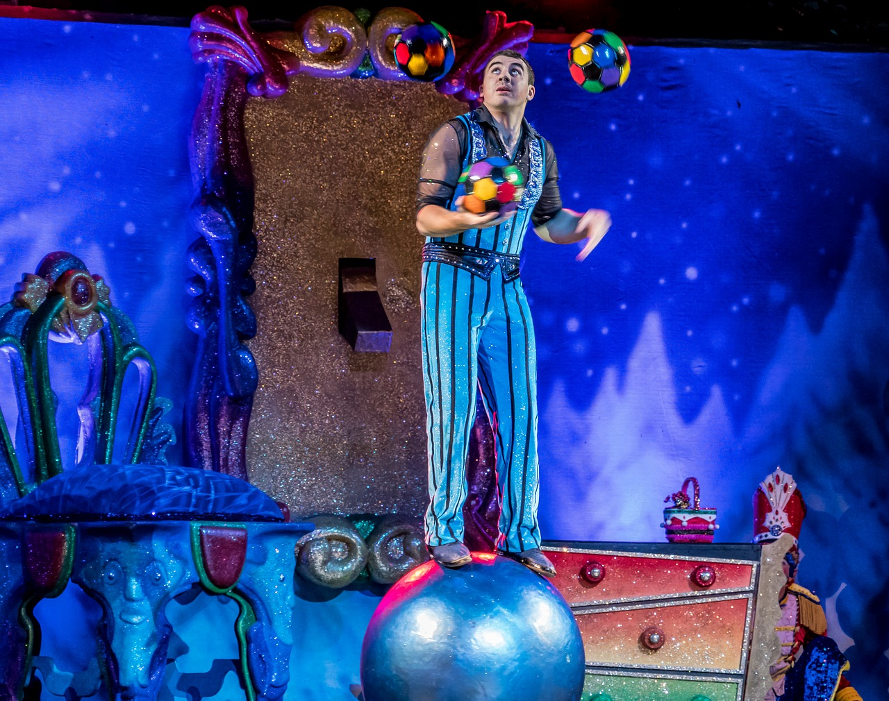

> One of the nice things about being busy is it makes you focus on what's important to you and how you use your time -- Lorne Michaels

------

When I was very young, probably less than 10 years old, my mom brought me to the Ringling Brothers Circus at the [Jos Louis Arena](https://en.wikipedia.org/wiki/Joe_Louis_Arena) in Detroit, Michigan.  It was a surprise, so when I we got there I was completely thrilled.

Although it was over 30 years ago, I still have vivid memories of that show:  There were three performance rings on the arena floor where the [Detroit Red Wings](https://www.nhl.com/redwings) normally played hockey.  Above the rings there was rigging for the trapeze shows, and a tight-rope that spanned the entire length of the arena.

In the far left ring there was a comically small car driving around and around.  When it finally stopped it seemed like dozens of clowns flooded out of the car.

As soon as the clowns left the ring, a scantily-clad woman rode a horse into the right ring.  While riding in loops within the circle she proceeded to stand, twirl, balance, then finally hand-stand on the horse's back.  

Next came the elephants and bears doing all kinds of remarkable things in the center ring.

For a couple of hours of what seemed to be complete chaos, the action shifted from ring to ring, up in the air, and then back to the floor.

There was always something going on, with each act designed to thrill, delight, or amaze the audience.

While there is little practical use for riding a horse while standing on your hands, or fitting crazy amounts of friends into a small car, there are two acts that we can learn from:  Tight-rope Walking, and Juggling.

## Tight-rope Walking

Imagine that you're standing high above a concrete floor, with loud noises, blaring music, and flashing lights all around you.  Your job is to walk along a thin steel cable, that is stretched 200-feet across an arena floor, to another high platform at the other end.  There are thousands of people staring at you.  Most of them want you to succeed, but at least a few of them are really hoping to see you fall.  Your life, at this moment, is quite literally "On the line":  If you mess this up, you are going to be seriously injured, or even killed.

You must narrow your focus, tuning out all of the distractions.  This is what you've been trained for.  You've practiced it over and over.  Focus.  Step.  Breath.  Step.  Breath...

Step by painstaking step you walk along, careful to keep your attention on where you want to be:  The other end of the rope.  Keep your mind on where you are going, not where you want to avoid.  Don't look down!

At some points in your life you will be this tight-rope walker.  The critical presentation at work, the once-in-a-lifetime exam, the championship race or game, the big audition...  You've prepared, practiced, fine-tuned, practiced some more, and now you're at the big moment.  It's now or never, and it is time to perform.

In these moments you must be able to narrow our focus, relax, and turn your attention to the desired outcome, no matter what happens.  It requires the ability to calm yourself when things aren't going according to plan, and to cope with distractions without getting thrown-off.  I've had the opportunity to practice this many times in my life, but one instance comes from my very first university exam.

The first semester of university was a particularly overwhelming experience.  I attended a fairly small high-school, then moved 800km to study engineering at the University of Ottawa.  In first year engineering, all students must take the same chemistry course.  The final exam for chemistry 101 had almost as many students as my entire high-school.  Hundreds of us were in the gym, all nervously writing our first exam.

Approximately 30 minutes into the exam, the person behind me fell out of his desk, and started thrashing on the floor, having a very bad seizure.  Several people rushed to help him, while the examiners instructed everyone around him to keep writing.  When it finished, after what seemed like several minutes, he vomited on the floor right next to me.  Paramedics arrived, worked on him, then took him away on a stretcher.  All the while we were told "Keep writing."  It was very clear to me:  Even though there is a huge distraction, and a medical emergency happening right next to me, this was the one chance I had to get a good grade in this course.  It was time to focus, or time to fall. 

## Juggling

Anybody that is even slightly coordinated can throw a ball up in the air, catch it, then toss it in the air again.  With a bit of practice, it's fairly easy to do the same with two balls at a time.  However, juggling three balls at once takes a lot more skill.  I've tried learning, but the amount of practice needed to get good at it was just not worth it for me.  Now when I see a really good juggler keeping 4, 5, or even 6 balls in the air I am absolutely amazed.

Much of the time our lives are like a skilled juggler:  We all have many items competing for our attention.  The trick it to give each one the amount of attention that it needs to keep it from falling to the ground.  Our work alone has enough competing priorities to keep us busy.  Add to that being a parent, student, volunteer, friend...  At any given moment there is "The one most important thing to do right now", and several more things lined up, ready to need your immediate attention.

## Juggling Knives While Trying not to Fall

Last year my sons and I went to a medieval festival about an hour and a half from our home.  While we were there a busker was performing a juggling act.  He started out with balls, then moved on to bowling pins.  It was very entertaining to watch the pins whirl though the air, while he spun around, catching them behind his back then tossing them up again.  He asked the crowd for a volunteer, then pointed at me to come forward because he needed someone tall.  

When I came to the front the juggler used me as a crutch so that he step up onto a board which was balanced on a cylinder.  Once he got up, and gained his balance, he had me hand him three knives, and began to juggle them.  As if managing three flying knives while trying not to fall off the board weren't enough, he them had me give three more knives.

While attempting to juggle the six knives, he dropped one of them.  It stuck ominously into the ground right next to me.  While it thrilled the crowd, and was probably part of the act, I wasn't as sure I wanted to continue standing near him after that.  In the end he was juggling five sharp knives, standing precariously on a board, balancing on a rolling barrel.

When he finished his stunt I turned around to face the audience and take a bow.  My eldest son had hands over his eyes, and his back turned toward me.  He was sure the performer was going to hurt me, and couldn't bear to watch.  Everyone else was looking on with morbid curiosity to see what was about to happen.

Our lives can be a lot like that moment:  There are a lot of responsibility that can inflict pain if not managed properly.  In order to keep them all maintained, we must focus on staying balanced.  If we fall, everything else falls too.

## The Lesson: Stay Centered and Don't Fall Down

The crazy juggler can teach a few things:

1. First, get your balance.  If you're not able to stand on your own, get someone to help you up
2. Once you are balanced, take on a couple of things that need your attention
3. Just because you drop one thing, don't let all the other things fall too
4. Realize that some people are watching hoping you fall, and others are praying that you succeed
5. Finally, no matter how many things you're trying to manage, the most important thing is to stay centered and don't fall down