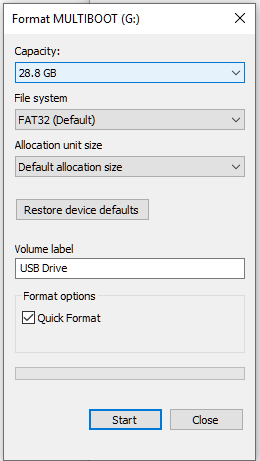
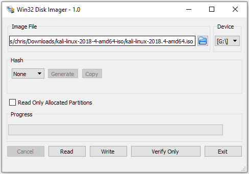
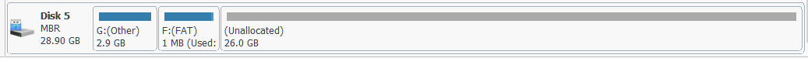
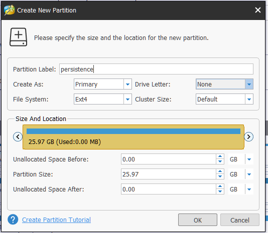

Photo by [Brina Blum](https://unsplash.com/photos/Bb_X4JgSqIM?utm_source=unsplash&utm_medium=referral&utm_content=creditCopyText) on [Unsplash](https://unsplash.com/search/photos/usb-drive?utm_source=unsplash&utm_medium=referral&utm_content=creditCopyText)

------

# I Keep Breaking Things

As a software engineer I am very curious about the computers that I use at home and at work.  I'm always tinkering with my machines, and quite frequently mess things up to the point of needing to rescue myself.

Most of the time, when I break something, I reach for a Live Linux DVD.  These have bailed me out numerous times.  However, I am always frustrated that I lose my work when I reboot.  If my fix wasn't correct, I have to try again from scratch!

One of the Live DVDs that I often use is a Kali Linux disc that has an interesting feature:  "Boot With Persistence."  That sounds promising!

If I make a USB drive that had this feature, I could have a little "Linux on a Key-Chain" that I could plug in any time I mucked up my PC/Mac.  Users of Kali Linux might recognize other potential uses for a discrete, portable Kali install.  However, that is for another article that I would likely write using a pseudonym.

# Goals

1. Boot Kali Linux on any PC or Mac, from my key chain USB drive
2. Have my changes persist across boots, and across machines.  This means that I need to make the persistent storage reside on the USB drive itself, and not some location on the machine's drives.

# What You'll Need

1. A Windows machine - This can also be done from Linux machine, but I can't currently boot into my Linux because I broke it.  Hence the reason I'm writing this...
2. 32 GB USB 3.1 Drive - You can probably use something smaller, but I'm working with what I have on hand
3. [ISO Image for Kali Linux](<https://www.kali.org/downloads/>) - I chose 64-Bit, Version 2018.4
4. [MiniTool Partition Wizard](<https://www.partitionwizard.com/free-partition-manager.html>) - We'll use this to create the persistence partition on the USB drive
5. [Win32Disk Imager](<https://sourceforge.net/projects/win32diskimager/>) - This is used to burn the ISO to the USB drive

## Making the Bootable Drive

*Warning: You are about to erase everything on your USB drive!  Make sure you are paying attention!*

### Format the USB Drive

* Choose FAT32 for the file system

* Default allocation size should be fine

  

  

### Burn the Kali ISO to the USB Drive

* Open Win32DiskImager
* Select the image file to write
* Select the target USB Device

* Click on 'Write', then confirm your selections and click 'Yes' when prompted

The write should take a couple of minute, depending on the image you are using, and the speed of your drive

### Add the Persistence Partition

* Install and open MiniTool Partition Manager - It's going to try to get you to install McAfee and other stuff, but if you unselect the 'I Agree' boxes you can get past them

* Create an EXT4 partition in the (Unallocated) space left on the USB drive

  

* Important:  Name the partition 'persistence'

  

* Apply the changes - This might take a while, depending on the drive speed and partition size

  

* Exit the MiniTool Partition Wizard

### Boot from the USB Drive

* Restart your computer, and do whatever it takes to boot from the USB Drive
* At the Kali boot screen, select the option for Live USB Persistence"
* The default username and password in Kali:
  * Username: root
  * Password: toor

### Enable Persistence

Once Kali is booted you will need to do the following:

*  Start a terminal, and change to root (if you're not logged in as root already)

  `sudo su`

* Figure out which partition your persistence partition is (mine was /dev/sdb3)

  `fdisk -l`

* Mount the partition

  `mkdir -p /mnt/my_usb`

  `mount /dev/sdb3 /mnt/my_usb`

* Enable persistence on the partition

  `echo "/ union" > /mnt/my_usb/persistence.conf`

* Unmount the partition

  `umount /dev/sdb3`

From now on when you boot 'Live USB Persistence' your files from the previous session will remain.

# Next Steps

Now that you've got a handy "Kali on a Key-Chain" you can customize it to your heart's content.  Here are a few things I did right away:

1. Update the system to deal with any possible security problems
2. Add a user, so that I'm not running as root all the time
3. Install packages that I frequently use:
   1. vim
   2. git
   3. python3
   4. NodeJS
4. Install Visual Studio Code and a few of my favourite plugins
5. Install my preferred web browser and extensions
6. Clone my repo for this blog, so I could keep editing this file, then push it from my USB distro
7. Finish posting this article from the newly created distribution

### Credits

I spent all weekend trying to get this working with a different distro, then finally stumbled upon the [Instructions to do it with Kali](https://docs.kali.org/downloading/kali-linux-live-usb-persistence).

It took some tweaking to make it work from Windows.  There is a [nice video of someone demonstrating the process on Youtube](https://www.youtube.com/watch?v=C-O8UoJA-gw)

